# Veritas

A grounded finance assistant over a bank, account and transaction ledger. You
ask in plain language; a small language model turns the question into a
structured query plan; DuckDB computes the answer from Parquet; and the answer
comes back with the rows behind it, the other readings that would have changed
it, and a Stable / Sensitive / Fragile verdict.

## 1. What it is

Two people ask the same question of the same ledger and get different numbers.
Not because either of them is careless, and not because the data is wrong, but
because the question hides an assumption. "What did we spend last month?" does
not say whether spend means debits or debits net of credits, whether bank
charges belong in the total, whether the month is a calendar month or the last
thirty days, or whether "we" means the entity or one of its accounts. Every one
of those is a defensible reading, each produces a different figure, and a
dashboard shows you one of them without telling you which.

Veritas answers the question and then tells you how much the answer depended on
the reading. It computes the number under the default interpretation, recomputes
it under every other reasonable interpretation, and reports the largest movement
as a verdict: Stable if the readings agree, Sensitive if they diverge a little,
Fragile if the choice of reading dominates the answer. Alongside the figure it
shows the query that produced it, the rows it read, and any counterparty whose
spend stands clear of its own history. When the data cannot answer the question
it says so, and when the question is genuinely ambiguous it asks rather than
guessing.

## 2. Why grounding is the whole point

The model never computes a number, never sees a raw record, and never writes
SQL. It has exactly one job: turn a sentence into a `QueryPlan` that validates
against a frozen JSON Schema. Everything after that is deterministic.

Every figure that is shown or spoken must already appear in the computation's
`allowed_numbers` list. A sentence containing a number the computation did not
produce is replaced by the template sentence rather than displayed. That check
is not advisory and it is not a prompt instruction — it is code between the
model and the screen, and it is the reason a wrong plan produces a refusal or a
clarification rather than a confident wrong figure.

The same boundary carries the sensitive columns. An account number or a UTR
typed into a question is swapped for a placeholder before the prompt leaves the
process and restored in the plan that comes back, so the model reasons about
`IDENTIFIER_1` while the query service receives the real value.

## 3. Architecture

The dividing line down the middle is the product. To its left the model works in
words. To its right nothing is uncertain: templates, bound parameters, and
arithmetic.

```mermaid
flowchart LR
  Q["Question<br/>typed or spoken"]

  subgraph MODEL["Model side — words only, never a number"]
    SAN["Prompt sanitiser<br/>identifiers to placeholders"]
    LLM["Language model<br/>openai/gpt-oss-20b, 20B"]
    PLAN["QueryPlan<br/>or clarification, or refusal"]
  end

  subgraph DET["Deterministic side — every number is computed here"]
    VAL["Plan validation<br/>frozen JSON Schema"]
    VER["Verify against the catalog<br/>intent, period, names, no sensitive column"]
    DUCK["DuckDB<br/>approved template, bound parameters"]
    PARQ[("Parquet<br/>encrypted account_number and utr_number<br/>redacted narration")]
    ALT["Alternative readings<br/>one axis flipped at a time"]
    ANOM["Anomaly scan<br/>counterparty against its own history"]
    PKG["VerifiedResultPackage<br/>value, evidence, alternatives, verdict, allowed_numbers"]
  end

  GRD{"Grounding check<br/>every shown number in allowed_numbers"}
  ANS["Answer, evidence and verdict<br/>masked to last four"]
  SPK["Speech"]

  Q --> SAN --> LLM --> PLAN --> VAL --> VER --> DUCK
  PARQ --> DUCK
  DUCK --> ALT --> ANOM --> PKG --> GRD
  GRD -->|grounded| ANS
  GRD -->|not grounded| ANS
  ANS --> SPK

  classDef model fill:#f4f0e8,stroke:#8a7f6a,color:#2b2b2b
  classDef det fill:#eaf1f0,stroke:#3f6f68,color:#2b2b2b
  class MODEL model
  class DET det
```



Masking and encryption apply on the deterministic side only: `account_number`
and `utr_number` are encrypted in Parquet with a plaintext `_last4` column
beside them, narration is redacted at load time, and an outbound leak guard
scrubs every response as the last step before it leaves the query service.

`docs/architecture.md` is the longer version of this diagram.

## 4. The five stages

| Stage | What happens |
| --- | --- |
| Understand | The model reads the question and writes a QueryPlan. |
| Verify | The plan is checked against the frozen schema and the live catalog. |
| Compute | DuckDB runs an approved template with bound parameters over Parquet. |
| Test | The same question is recomputed under every other reasonable reading. |
| Answer | The package is grounded, masked and explained. |

Each stage keeps its own artifact, and clicking any figure in the answer traces
it back to the template, the filters, the row count and the SQL that produced it.

The verdict comes from fixed thresholds, applied to the largest movement across
the alternative readings. Under 5 per cent is **Stable**, 5 to 15 per cent is
**Sensitive**, above 15 per cent is **Fragile**, and a question with no
applicable axis is Stable with a single-reading note. A movement only counts
towards the threshold if it is material: at least 1,000 rupees in absolute
terms, so a large percentage swing on a trivial sum does not raise an alarm.

## 5. Data flow at load time

1. **Ingest.** Source JSONL or CSV for bank, account and transaction is read in
   chunks. `services/query/schema.yaml` maps logical names to physical columns,
   so a new dataset is a config change rather than a code change.
2. **Resolve.** The Counterparty Resolver decodes each bank narration into
   channel (NEFT, IMPS, UPI, RTGS, FT, Disbursement, Charges, Cheque, Other),
   counterparty, IFSC and reference. Doing this once at load time is why
   aggregates never re-parse text.
3. **Encrypt.** `account_number` and `utr_number` are encrypted before anything
   is written, and a plaintext `_last4` column is stored beside each. The
   narration is stored already redacted.
4. **Write.** Parquet, plus a `rollups.parquet` of one row per month, account,
   direction, channel and counterparty. Its size is bounded by distinct
   combinations rather than by row count, which is what keeps aggregates fast
   past twenty million rows.
5. **Catalog.** Entities, accounts, counterparties and data bounds, which is the
   only view of the data the model is ever given.

## 6. Model choice, and why

**Shipped: `openai/gpt-oss-20b`, 20 billion parameters**, served on an
OpenAI-compatible endpoint.

The problem statement caps the model at 20B, so the question is what to spend
that budget on. The model here has one job — turn a sentence into a plan — and
the property that matters most for that job is not general capability but
**strict `json_schema` constrained decoding**, which this model supports. The
plan is shaped by the contract during generation rather than coaxed by
prompting, then validated against `contracts/query_plan.schema.json` before
anything is computed. A plan that fails validation is retried once with the
errors and then refused.

What a larger model would have bought is better paraphrase coverage: mapping an
unusual phrasing onto the right intent. What it would not have bought is a more
accurate number, because the model does not produce numbers. That asymmetry is
the whole argument for staying small: the failure mode of a weaker model here is
a clarification or a refusal, never a wrong figure.

Measured accuracy is in `eval/benchmark.json` and on the `/benchmark` page.
**The per-model accuracy in that file has not yet been measured against the live
endpoint** — the figures are placeholders carried over from the fixture, and the
file says so. Running `eval/run_benchmark.py` replaces them, and needs a
provider allowance larger than the free tier's 200,000 tokens per day.

What has been measured, on the running stack:

| Measure | Result |
| --- | --- |
| Computation accuracy vs. independent pandas ground truth | 1.0 over 44 questions |
| Intent, filters, clarification | 1.0 |
| Grounding (answer restated from an independent recomputation) | 1.0 |
| Resolver coverage, synthetic 100k | 0.9701 against a 0.95 budget |
| Query latency, 100k rows | 20–220 ms |

## 7. Security

`account_number` and `utr_number` are encrypted at rest in Parquet with a
plaintext last-four column beside them; narration is redacted at load time;
every response passes an outbound leak guard; exports and the spoken sentence
are redacted; and identifiers are held back from the model behind placeholders.

Deliberately **out of scope**, and not built: multi-tenant isolation, user roles,
production authentication, and key management beyond an environment variable.
The query service is unauthenticated and expects to sit behind a network
boundary. The encryption is deterministic, which keeps equality lookups working
and leaks equality — a documented trade, not an oversight.

`docs/security.md` states all of this in full, including the limits.

## 8. Setup

**Prerequisites:** Node 20+, Python 3.11–3.13 (3.14 has no DuckDB or pyarrow
wheels yet), and `make`.

```bash
git clone https://github.com/hack05-afk/Veritas.git
cd Veritas
npm install
python3 -m venv .venv && .venv/bin/pip install -r services/query/requirements.txt
cp .env.example .env
```

Generate the encryption key and put it in `.env`. The loader and the query
service refuse to start without it, by design:

```bash
python3 -c "import os,base64;print(base64.b64encode(os.urandom(32)).decode())"
```

| Variable | What it does |
| --- | --- |
| `LLM_PROVIDER` | `openai_compatible` for a real model, `fake` to run from fixtures with no network |
| `LLM_BASE_URL` | OpenAI-compatible chat completions base URL |
| `LLM_MODEL` | Model id. Must be 20B parameters or fewer |
| `LLM_API_KEY` | Key for that endpoint |
| `LLM_MAX_COMPLETION_TOKENS` | Answer headroom, default 1024. Hosted endpoints bill this reservation against a tokens-per-minute budget, so raising it cuts throughput |
| `SARVAM_PROVIDER` | `fake` uses the fixture clips; `sarvam` calls the real speech API |
| `SARVAM_API_KEY` | Key for speech to text and text to speech |
| `VERITAS_ENCRYPTION_KEY` | 32 bytes, base64. Required |
| `VERITAS_ENCRYPTION` | Set to `off` to run on plaintext locally; warns on every start |
| `QUERY_SERVICE_URL` | Where the web app finds the query service |
| `DUCKDB_MEMORY_LIMIT` | Default `1GB` |
| `DATA_DIR` | The dataset the loader wrote. Relative paths resolve from the repository root |

Generate and load a dataset, then start both services:

```bash
make data
make dev
```

- Web app: <http://localhost:3000>
- Workspace: <http://localhost:3000/workspace>
- Query service: <http://localhost:8000>, health at `/health`

With `LLM_PROVIDER=fake` only the fixture questions are understood; anything else
is refused. That is the fixture table doing its job, not a fault. Set a real
provider to ask freely.

## 9. Running the demo

```
/workspace?demo=1        probes, then runs live if both services answer
/workspace?demo=replay   the whole sequence from recorded streams, no network
```

Press space to begin. Right arrow or space advances, left arrow goes back,
Escape exits. Six beats: a grounded answer, a follow-up that carries the
previous plan, a Sensitive verdict, a clarifying question, a refusal, and the
evidence with a CSV export.

In live mode a beat that errors or takes more than 25 seconds is replayed from
its fixture, and the bar shows an amber "replayed from fixture" chip when that
happens. A recorded result is never presented as live. `docs/demo.md` has the
presenter script.

## 10. Tests

The test suites are run with pytest, Vitest and Playwright and cover, in order:
the contracts and fixtures; the synthetic generator, loader and counterparty
resolver; the query intents with evidence and masking; the alternative readings,
anomalies and reconciliation; the orchestrator, plan validation and redaction;
the design system; the reasoning theatre, evidence drawer and CSV export; the
live end to end path and the Ledger Pulse; voice; and the evaluation and
documentation.

What runs from a clean clone, with both services up:

```bash
python scripts/check_keys.py        # the provider key, the model, structured output
python eval/ground_truth.py         # recompute every intent in pandas, independently
python eval/run_eval.py --out eval/results.json   # accuracy over 44 questions
python eval/run_benchmark.py        # compare candidate models
npm run typecheck --workspace apps/web
npm run build --workspace apps/web
```

`eval/ground_truth.py` is the one that matters most: it recomputes every intent
in pandas directly over the raw files, with no reference to the query service, so
a matching answer is agreement between two independent implementations rather
than a test asserting the code does what the code does.

## 11. Project layout

| Path | What is in it |
| --- | --- |
| `apps/web/` | Next.js App Router front end, the orchestrator and every API route |
| `packages/ui/` | Design tokens and the component set the app is built from |
| `services/query/` | FastAPI and DuckDB query service, loader, resolver, crypto |
| `contracts/` | Frozen JSON Schemas and the query service OpenAPI |
| `fixtures/` | Sample rows, plans, results, packages, recorded event streams, voice clips |
| `eval/` | Ground truth, test set, scoring and the benchmark runner |
| `docs/` | Architecture, security, ingestion, demo script, sample Q&A, failure case |
| `infra/` | Deploy configs and the runbook |
| `scripts/` | Operational checks |

## 12. Deployment

`infra/RUNBOOK.md` has the full procedure: the web app to Vercel from
`infra/vercel.json`, the query service to Render from `infra/render.yaml` and
`services/query/Dockerfile`. Every variable in `.env.example` must be set in both
dashboards, including `VERITAS_ENCRYPTION_KEY`. No values are committed.

## 13. Sample questions and answers

| Question | What comes back |
| --- | --- |
| What did we spend last month? | A total, split by channel, with a verdict on how much the reading matters |
| Compare that with the month before | The two periods side by side, carried from the previous plan |
| Who were our top five counterparties last quarter? | A ranking, with the alternative readings that move it |
| How much did we pay SELECTION last quarter? | A clarifying question, because several counterparties start with that word |
| How much did we spend on the marketing category? | A refusal: there is no category column, and a list of what can be answered |
| Find the transaction with reference 1715499972 | One row, with the account number and UTR masked to their last four |

`docs/sample_qa.md` has the full set with the real answers from a recorded run.

## 14. Limitations

- **The benchmark numbers are not yet measured.** `eval/benchmark.json` carries
  placeholder per-model accuracy and says so in its own rationale field. The
  measured figures in section 6 come from the evaluation over 44 questions, which
  scores the computation, the grounding check and the guardrails.
- **Free-tier provider budgets are the binding constraint on live testing.** The
  configured endpoint allows 8,000 tokens a minute and 200,000 a day, and a
  hosted endpoint bills the reserved `max_completion_tokens` rather than what a
  call spends. That is why the default reservation is 1,024.
- **Conversation memory is in-process** and expires after thirty minutes. There
  is no database behind it, so a restart forgets every conversation.
- **Voice runs from fixture clips** unless `SARVAM_PROVIDER` is set to the real
  provider. The Sarvam request shapes are written from the documented API.
- **Security scope.** Multi-tenant isolation, user roles and production
  authentication are out of scope and are not built. See section 7.
- **The dataset is synthetic** unless a real one has been ingested. It is
  generated with a fixed seed so every expected value can be recomputed
  independently.
