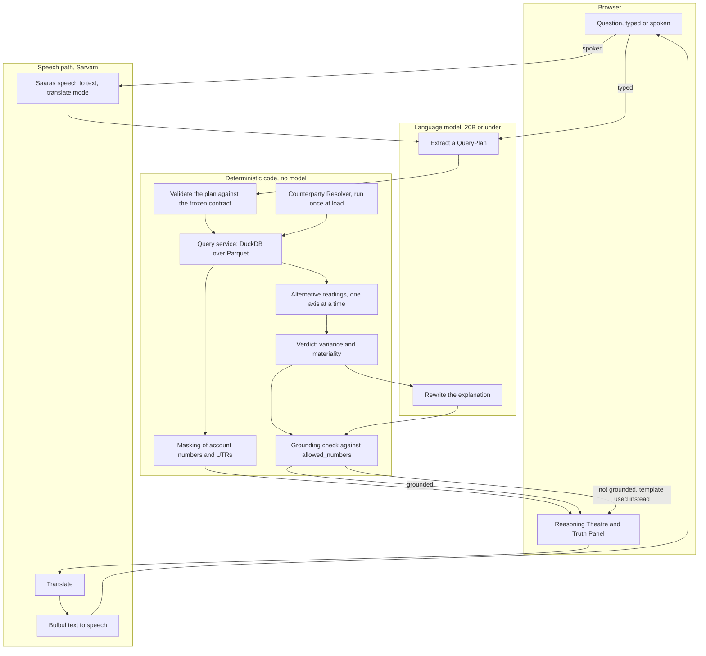

# Architecture

The whole design rests on one boundary: the language model reads and writes
words, and deterministic code produces every number. Nothing crosses that line.

## What each side may do

The model may choose an intent, name a counterparty, resolve a period into
dates, and rewrite two sentences of explanation. It never sees a raw
transaction, never receives an account number or a UTR, never writes SQL and
never produces a figure.

The deterministic side owns everything that ends up as a number. Plans are
validated against `contracts/query_plan.schema.json` before they run, so an
invalid plan is a 422 and never a wrong answer. Queries come from templates in
`services/query/app/queries/` with bound parameters only, so a counterparty
named `X' OR 1=1 --` simply matches nothing. Alternatives are recomputed by the
same code path as the primary, one interpretation axis at a time, so they are
comparable with the number they sit beside.

## The grounding check

Every answer carries `allowed_numbers`: every figure the computation actually
produced. The model's rewritten explanation is scanned for digit runs, and it is
kept only if every one of them appears in that list. Otherwise the templated
sentence is used and the package records `explanation_source: "template"`. This
is why the model cannot state a number that was never computed.

## The speech path

Speech never touches the planning model. Audio goes to Saaras in translate mode
and comes back as English text, which enters the same pipeline a typed question
does. The answer is converted to Indian words by the Speech Writer before it
leaves the deterministic side, so what is translated and spoken contains no
digits and no symbols at all. The speak endpoint rejects text containing digits,
currency symbols or dashes rather than reading them out.

## Scale

The Counterparty Resolver runs once, at load, and its output is materialised
into Parquet, so no aggregate ever re-parses a narration. The loader reads the
transaction table in blocks and writes Parquet row groups, and the generator
makes two passes over a seeded stream rather than holding the ledger in memory,
so row count does not drive memory use. Row level evidence is always paginated.
